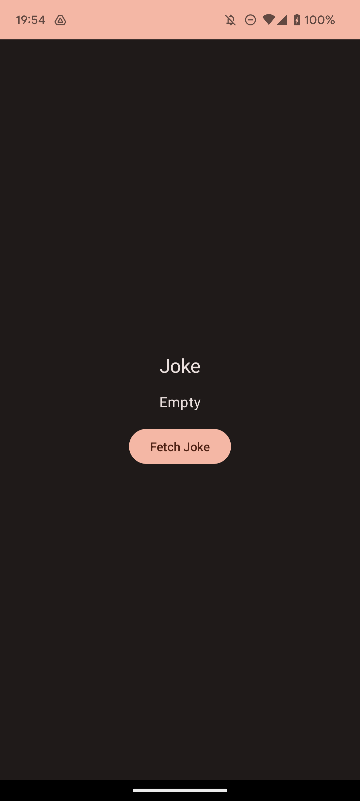
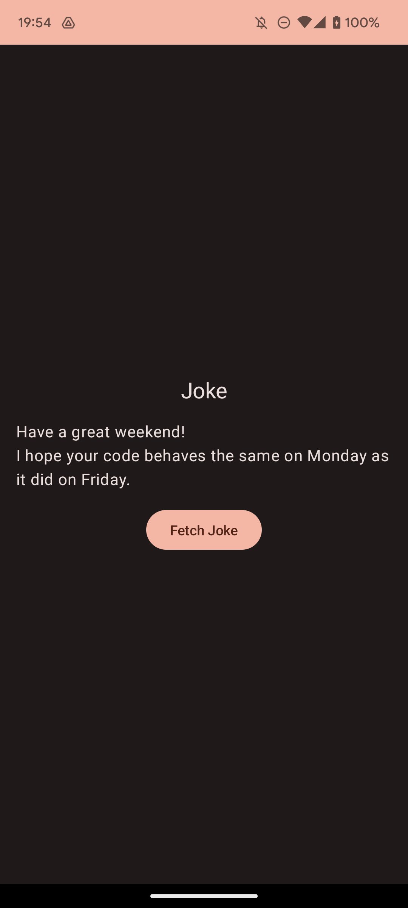
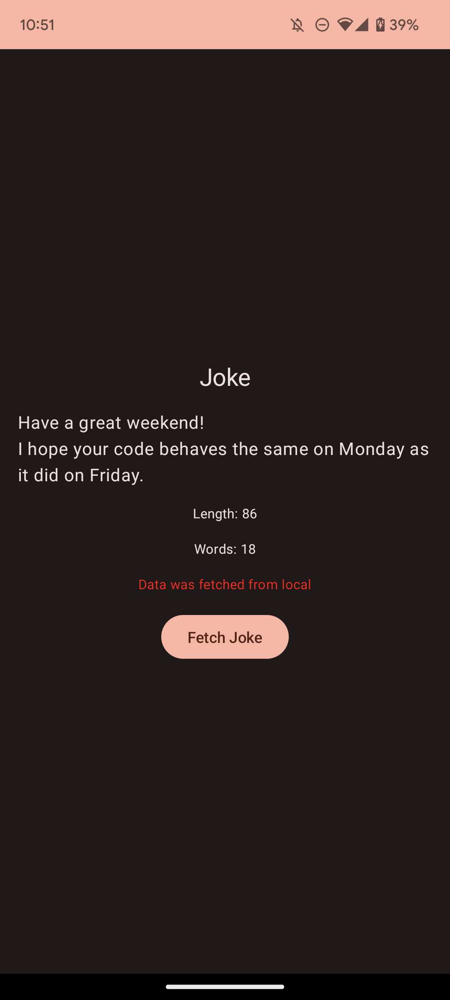

# Starting Your Code Challenge
### About the Tasks
The tasks in this challenge don't have very detailed instructions. We know our requirements might not be perfect.

If you have a better idea (like something more efficient or creative), feel free to use this as an opportunity to showcase it. You don't have to follow our descriptions exactly 👍

### About libraries
You are free to choose and use any libraries that you deem necessary to complete the tasks.

And if you haven't used a certain library (like Jetpack Compose) or aren't very confident with it, you can:
- Choose a different way of achieving the same result (for example, use `databinding` instead of Jetpack Compose)
- Take some time to learn it and then try it out

### Time
We haven't set a time limit. Take as much time as you need and don't stress.

But, we also don't want you to spend too much time on this. Here’s how long you should spend on this:
- 2~3 hours

# Tasks for the Joke App
This app shows a joke regarding engineering.

|Placeholder|Joke|
|----|----|
|||

### Current issues
- Currently, this app can only show one joke which is hard-coded in the app.

### Things to Do (TODO)
- Fetch a random joke from https://v2.jokeapi.dev/joke/Programming?type=single and display it when the user presses the "Update Joke" button.
  -  Every time the user presses the "Update Joke" button, the displayed joke should be updated from the API. 
- Add a local data source so the user can see the last-fetched joke even offline.
- If the joke could not be fetched from the API and had to be fetched from the local source, let the user know about it by adding another text component such as "Data was fetched from local". 
- Use dependency injection such as Hilt
- Display the `length` from the API under the `Joke` *only if* it’s more than 80
- Display how many words the joke sentence contains. For instance, "Debugging: Removing the needles from the haystack." contains 7 words then should show "Words: 7"
- Add tests (unit or UI) based on your code

---
### How It Should Look After You're Done

---
# What We’re Looking For
- An app that meets all of the functional requirements above.
- Your coding style - show us how you like to write your code.
- Architecture - how you’ve structured your code.
- Principles - how you believe code should be written.
- Quality - how you guarantee your code is functioning correctly.

# How to Submit
To submit your work:
- Make a pull request
- Send us the link to your pull request 🙏
    - We'll give comments for the next steps
